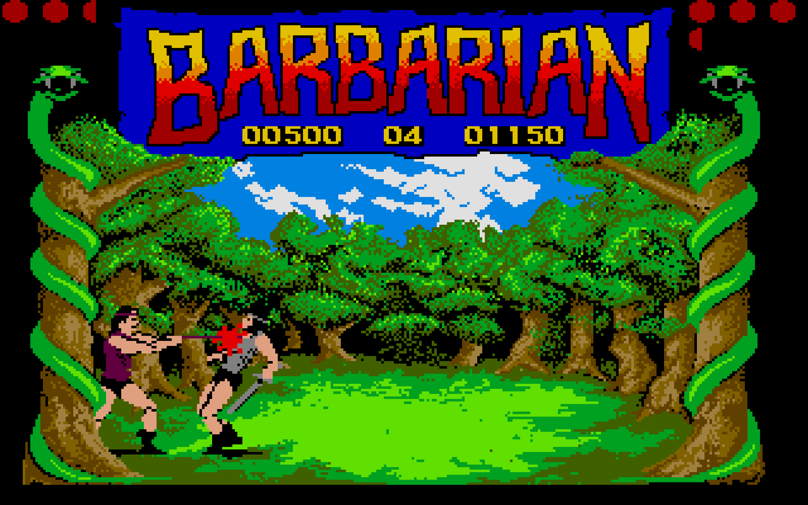

# A handful of pixels of blood – Decoding early video game graphics

What is the purpose of blood splattering onto the screen in a video game? Does it serve functional value or is it mere decoration, intended to shock the user? Video game graphics are not only narrative and aesthetic devices comparable to films, but also hold functional information for players and are of an interactive nature [@fizekLudicGlassMaking2022; @gerlingScreenImagesInGame2022]. Traditional image analysis struggles to encompass images from video games due to their focus on analogue or passively consumed media. How than to analyse blood spurting from a body? 

In my dissertation project, I’m researching graphics programming in 1980s and 1990s video games. Besides critical analysis of source code, I also extensively research formal aspects of the video game images. For the latter, I depend on the *Framework for the Analysis of Visual Representation in Video Games* (FAVR) for the proper description and annotation of the image corpus. FAVR [@arsenaultGameFAVRFramework2015] explicitly deals with problems of analysing video game graphics and guides annotation of game graphics by their functional, material, and formal aspects and aids in analysing narrativity and the rhetoric of aesthetic aspects.

To streamline and support image annotation of extensive corpora, I rely on automation. So far, FAVR has only been applied in formal or discourse analysis , limiting its scope. Based on my approach, I need to research to what extent FAVR can be leveraged to applications of distant viewing of larger video game image corpora.

This project thus inquires into the viability of translating the FAVR model into a linked open data ontology which can be applied in Tropy or other image-annotation tools. The ontology will be applied in case studies of early Swiss video games and annotated images serve as training material to test building automatic image annotation models.

## Bibliography